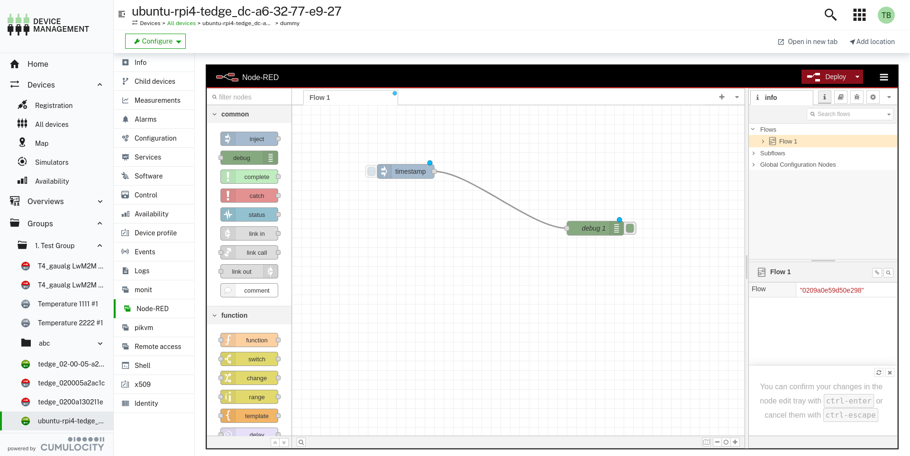

# Remote access cloud HTTP proxy

A Cumulocity IoT microservice that allows to proxy HTTP requests through the cloud to an HTTP server running on a Cumulocity IoT connected device.
This project contains a backend microservice and a UI plugin. Both must be installed your tenant in order to use this functionality.

A sample usecase might be to access a configuration UI on your device or to e.g. access an instance of [Node-RED](https://nodered.org/) running on your device:

## Prerequisits & Limitations

This functionality is heavily relying on the [Cloud Remote Access feature of Cumulocity](https://cumulocity.com/guides/cloud-remote-access/cra-general-aspects/).

- **PASSTHROUGH endpoint:** To use the proxy you need a remote access `PASSTHROUGH` endpoint configured on each of your devices you want to connect to. See [this guide](https://tech.forums.softwareag.com/t/how-to-get-started-with-cloud-remote-access-for-cumulocity-iot/258446#step-by-step-guide-to-setup-a-passthrough-connection-16) for further details.

- **Tenant Authentication Method:** The desired tenant must be configured to use the [`OAI Secure` Authentication](https://cumulocity.com/guides/users-guide/administration/#authentication)

- **Disable XSRF-Token validation**: The XSRF-Token validation of Cumulocity needs to be disabled for the tenant. Please check on your own if this might be a security concern for you: [Cross-site request forgery](https://en.wikipedia.org/wiki/Cross-site_request_forgery). To do this, the corresponding tenant option (category: `jwt`, key: `xsrf-validation.enabled`) must be set to `false`.

- You can only communicate with a single web server per browser. You might be able to workaround this by using multiple browsers or incognito windows.

- This functionality is currently limited to just communicate via HTTP. HTTPS would be in general also doable, but there is not really a benefit in encrypting the connection to the device another time (as the websocket connection is already encrypted) and it would still not be end-to-end encrypted.

- The web server you are trying to access must be compatible with being served behind a reverse proxy with another path (which is in this case: `/service/cloud-http-proxy/`). This might be something you can configure as part of your application, but not all applications support this.

In case you are reaching the limits of this tool, you can also give [remote-access-local-proxy](https://github.com/SoftwareAG/cumulocity-remote-access-local-proxy) a try. This requires an application be to executed locally, but is not limited to just the HTTP protocol.

## Microservice

The microservice is written in nodeJS.

It's functionality can be described in the following steps:

1. Accept incoming connections
2. Read all incoming TCP packets until we have the complete HTTP header.
3. The Cookie header is parsed to make use of the authentication and the custom `cloudProxyConfigId` & `cloudProxyDeviceId` cookies in the next steps
4. The authentication information is used to create a new remote access connect session. The device ID and remote access connect configuration Id is taken from the previously parsed cookie.
5. After the remote access connect Websocket connection was established successfully, it will send the already read HTTP header and all susequent TCP packets through the Websocket connection to the web server running on the device. Packets received through the websocket connection are also forwarded in the other direction.

## UI Plugin

The UI plugin adds tabs on device level to the application it has been installed to.
The UI detects remote access connections available for the device that have been prefixed with `http:` and use the `PASSTHROUGH` protocol.

For instructions on how to install an UI plugin, please check [here](https://cumulocity.com/guides/users-guide/administration/#extensions).

### Configuring a new connection

A new connection can be configured on devices supporting the remote access connect feature.
The default UI of the remote access connect feature can be used for that.

The name of the configuration should be prefixed with `http:` as this is used by the UI Plugin to identify endpoints that are compatible with it.

The protocol should be set to `PASSTHROUGH`. In case this is not available, please contact your platform administrator to make it available.

You can then just enter the host and port that you would like to connect to with this configuration.
Below you can find a sample configuration for Node-RED.

Once you saved the new connection, an new tab will show up on the device.
It might be required to reload the page once for the tab to show up.

In case the tab does not show up, check the browsers console logs. In case you've missed to set a tenant option, you should see a warning there.

## How to demo this

1. Setup a device with an agent that supports remote access connect, e.g. [thin-edge.io](https://thin-edge.github.io/thin-edge.io/install/)
2. Install e.g. Node-RED via [their install script](https://github.com/node-red/linux-installers/#debian-ubuntu-raspberry-pi-os)
3. Create an remote access endpoint like described above.
4. Reload the page once and you should see a new tab on device level with the name that you have used for the connection.
